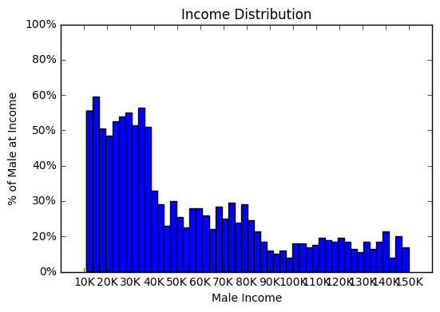
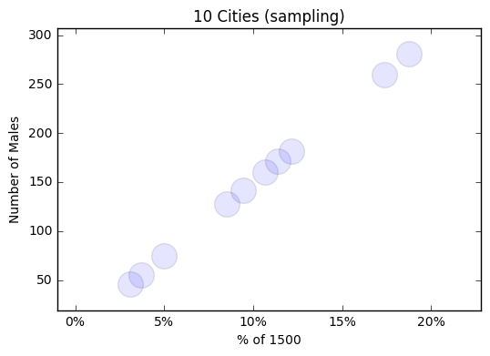

```python
import pandas as pd
import numpy as np
# import datetime
# from datetime import date
import matplotlib.pyplot as plt
import pandas_datareader.data as web
```


```python
# percentage of people from cities
cities = ["Bangor MA", "Boston MS","Baltimore MD", "Boca Raton FL","Birmingham AL","Benton AK","Buena Vista CO","Bend OR", "Boulder City NV","Bakersfield CA"]
num_cities = len(cities)
city_weights = np.random.random(num_cities)
city_weights /= np.sum(city_weights)
city_weights

```


    array([ 0.08519428,  0.09443051,  0.11382712,  0.17359238,  0.12148556,
            0.10679324,  0.0307468 ,  0.1872979 ,  0.03692611,  0.0497061 ])


```python
# number of people by city
number_of_people = 1500
number_of_people_by_city = np.round(city_weights * number_of_people)
number_of_people_by_city
```


    array([ 128.,  142.,  171.,  260.,  182.,  160.,   46.,  281.,   55.,   75.])


```python
people_by_city = np.column_stack((cities, number_of_people_by_city))
people_by_city
```


    array([['Bangor MA', '128.0'],
           ['Boston MS', '142.0'],
           ['Baltimore MD', '171.0'],
           ['Boca Raton FL', '260.0'],
           ['Birmingham AL', '182.0'],
           ['Benton AK', '160.0'],
           ['Buena Vista CO', '46.0'],
           ['Bend OR', '281.0'],
           ['Boulder City NV', '55.0'],
           ['Bakersfield CA', '75.0']], 
          dtype='<U32')


```python
# population by income and number of people
group_11_40K = np.random.randint(11000,40000,900)
group_40_85K = np.random.randint(40000,85000,525)
group_85_150K = np.random.randint(85000,150000,348)
# combining three groups together
income_results = np.concatenate((group_11_40K, group_40_85K, group_85_150K))
plt.hist(income_results, bins=50)
plt.yticks([0,20,40,60,80,100,120,140],['0%','20%','30%','40%','50%','60%','80%','100%'])
plt.xticks([10000,20000,30000,40000,50000,60000,70000,80000,90000,100000,110000,120000,130000,140000,150000],
          ["10K","20K","30K","40K","50K","60K","70K","80K","90K","100K","110K","120K","130K","140K","150K"])
plt.xlabel('Male Income')
plt.ylabel('% of Male at Income')
plt.title("Income Distribution")
# Save Figure
plt.savefig("income_distribution.png")
plt.show()
```





```python
"""
Scatter plot of samples by citiy
"""
plt.yticks([50,100,150,200,250,300])
plt.xticks([0,0.05,0.10,0.15,0.20,0.25],
          ["0%","5%","10%","15%","20%","25%"])
plt.scatter(city_weights, number_of_people_by_city, alpha=.1, s=400)
plt.xlabel('% of 1500')
plt.ylabel('Number of Males')
plt.title("10 Cities (sampling)")
# Save Figure
plt.savefig("10_cities.png")

plt.show()
```





```python

```
